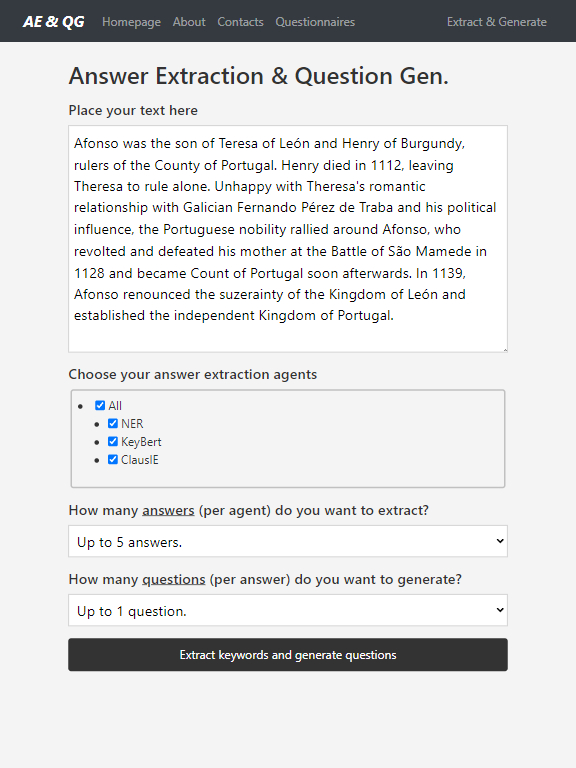

# Answer Extraction and Question Generation



## Overview
We present a tool capable of (1) extracting question-*worthy* answers from paragraphs and (2) generating questions from both paragraphs and answers.

## Rationale
> *Question Generation* (QG) aims to automatically generate questions given an input. This input often requires two components: the source text, and the word(s) that will make up the question's answer. When developing these QG systems, datasets consisting of paragraph-answer pairs are typically used. However, in real environment systems, **pre-identified answers are not widely available**. Thus, we propose a system capable of extracting question-worthy answers from paragraphs and generating questions from both paragraphs and answers. Formally, we define four components (aka agents). The first three (answer extractors) identify question-worthy answers from the paragraphs. The last one (generator) has the role of generating questions, considering both answer and paragraph pairs.

## Main Features

* Question-Worthy Answer Extraction using:
  *  Named Entity Recognition
  *  Keywords using BERT
  *  Clauses
* Question Generation with [T5](https://github.com/google-research/text-to-text-transfer-transform) model

## Prerequisites
```bash
Python 3
```

## Installation
1. Install the Python packages from [requirements.txt](https://github.com/bernardoleite/MAS-for-Answer-Extraction-and-QG/requirements.txt). If you are using a virtual environment for Python package management, you can install all python packages needed by using the following bash command:
    ```bash
    pip install -r requirements.txt
    ```
2. Install [spacy-clausie](https://github.com/mmxgn/spacy-clausie.git) (as indicated on the authors' page)
    ```
    git clone https://github.com/mmxgn/spacy-clausie.git
    cd spacy-clausie
    python setup.py build 
    python setup.py install [--user]

    # Optionally
    python setup.py test
    ```
## Usage
1. Web Application
    ```bash
    cd web_app/
    python app.py
    ```
2. Command Line
    ```bash
    TODO
    ```
## Issues and Usage Q&A
To ask questions, report issues or request features, please use the GitHub Issue Tracker.

## Contributing
Contributions are what make the open source community such an amazing place to learn, inspire, and create. Any contributions you make are **greatly appreciated**.

If you have a suggestion that would make this better, please fork the repo and create a pull request. You can also simply open an issue with the tag "enhancement". Don't forget to give the project a star! Thanks in advance!

1. Fork the Project
2. Create your Feature Branch (`git checkout -b feature/AmazingFeature`)
3. Commit your Changes (`git commit -m 'Add some AmazingFeature'`)
4. Push to the Branch (`git push origin feature/AmazingFeature`)
5. Open a Pull Request

## License
This project is released under the **General Public License Version 3.0 (or later)**. For details, please see the file [LICENSE](https://www.gnu.org/licenses/gpl-3.0.txt) in the root directory.

Additionaly, this project includes third party software components: [stanza](https://github.com/stanfordnlp/stanza), [KeyBERT](https://github.com/MaartenGr/KeyBERT), [spacy-clausie](https://github.com/mmxgn/spacy-clausie.git), and [T5](https://github.com/google-research/text-to-text-transfer-transformer) model. Each of these software components have their own license. Please see [stanza/license](https://github.com/stanfordnlp/stanza/blob/main/LICENSE), [KeyBERT/license](https://github.com/MaartenGr/KeyBERT/blob/master/LICENSE), [spacy-clausie/license](https://github.com/mmxgn/spacy-clausie/blob/master/License.txt), and [T5](https://github.com/google-research/text-to-text-transfer-transformer/blob/main/LICENSE) correspondingly.

**Note**: A commercial license may also be available for use in industrial projects and collaborations that do not wish to use the GPL v3 (or later). Please contact the author if you are interested.

## References
If you use this software in your research/job/work, please kindly cite our project:
```bash
@misc{ae_and_qg,
  author = {Bernardo Leite},
  title = {Answer Extraction and Question Generation},
  year  = {2022},
  version = {1.0},
  url   = {https://github.com/bernardoleite/MAS-for-Answer-Extraction-and-QG},
}
```

Also consider citing the third party software components (see on their respective pages): [stanza](https://github.com/stanfordnlp/stanza), [KeyBERT](https://github.com/MaartenGr/KeyBERT), [spacy-clausie](https://github.com/mmxgn/spacy-clausie.git) and [T5](https://github.com/google-research/text-to-text-transfer-transformer).

Other important references:
* [A Multi-Agent Communication Framework for Question-Worthy Phrase Extraction and Question Generation](https://ojs.aaai.org/index.php/AAAI/article/view/4700)

## Contacts
Bernardo Leite, bernardo.leite@fe.up.pt